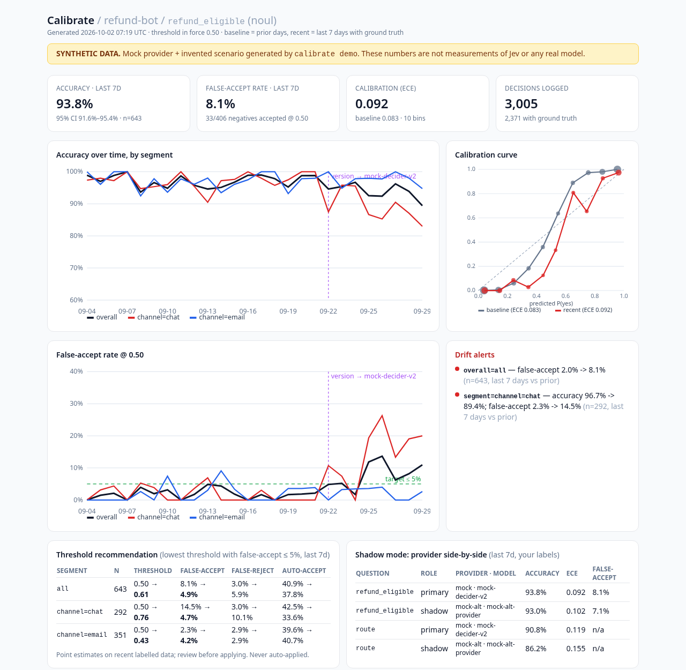

# calibrate (prototype)



Production monitoring for typed AI decision models (Jev-style `noul` / `choice` / `score`). Pure Python stdlib, Python ≥ 3.10.

```bash
git clone https://github.com/tstockham96/calibrate && cd calibrate
pip install -e .            # optional; or use `python3 -m calibrate ...`
calibrate demo --out demo_out          # SYNTHETIC end-to-end run -> demo_out/dashboard.html
python3 -m unittest discover -s tests  # tests
```

Real usage:
```bash
export TYPESAFE_API_KEY=...            # absent -> mock provider (clearly reported)
calibrate decide --db app.db --state '{"text":"Help! My payouts have been failing for 3 days."}' \
   --questions examples_questions.json --model jev-1.13.0 --segment channel=email --thresholds '{"is_urgent":0.7}'
calibrate ingest --db app.db outcomes.csv        # decision_id,question_key,actual[,observed_at]
calibrate report --db app.db --question is_urgent --out dashboard.html --target-far 0.05
calibrate alerts --db app.db --question is_urgent   # exit 2 when alerts fire (cron/CI)
```

Python:
```python
from calibrate import Monitor, MockProvider
mon = Monitor("app.db", shadow_providers=[MockProvider(name="mock-alt", use_sim_profile=False)])
res = mon.decide(state, questions, model="jev-1.13.0", segment="tier=pro", thresholds={"q": 0.7})
mon.record_outcome(res["decision_id"], "q", "yes")
```

What's logged per answer: decision_id, ts, provider, role (primary/shadow), resolved model, question hash, **state hash (raw state is not stored)**,
type, answer, probability, confidence, threshold in force, segment, latency, input tokens.

Metrics: accuracy (Wilson CI), reliability curve + ECE (10 bins), false-accept / false-reject at threshold, PSI (label-free), drift
(last 7 days vs prior, overall / per segment / per model version), threshold recommendation (lowest threshold with FAR ≤ target, and
cost-weighted), shadow side-by-side.

Real provider: `TypeSafeProvider` POSTs the documented shape to `https://api.typesafe.ai/v1/systemone` with backoff on 429/529
(https://docs.typesafe.ai/api.md). It has NOT been exercised against the live API here (no key). `OpenAIDecisionsProvider` is a
deliberate stub until the schema is public.

Synthetic demo: `calibrate/synth.py` invents a refund-bot scenario (a version change on day 19, argued chat tickets from day 22). None of it is a measurement of any real model.
